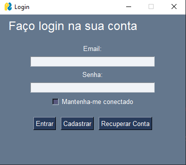
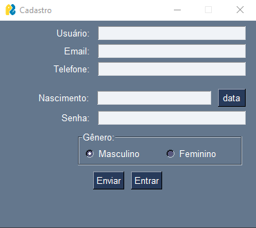
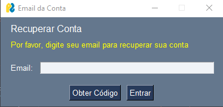
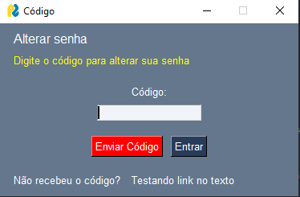
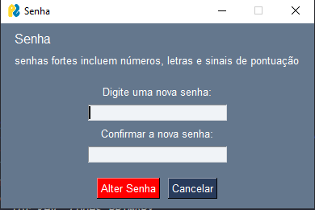

### Sistema de Autenticação  em Python

O sistema é uma aplicação desktop simples com cadastro e recuperação  de contas de usuários. O software foi construido usando `MySql` como banco de dados e `PySimpleGUI` para interface gráfica. O sistema tem como objetivo fins de estudos práticos, para compreenção e o funcionamento de um sistema de login completo, todo projeto foi feito sem auxilio de framworks, apenas com python puro. 

___
#### Configurações do projeto

Crie e ative um ambiente virtual 


Windows 

`python3 -m venv C:\path\to\new\virtual\environment`


`PS C:\> <venv>\Scripts\Activate.ps1`

Instale a depêndencias do projeto

`python3 -m pip install -r requirements.txt`

Configurações das variáveis de ambiente para o servidor smtp:
Crie um arquivo `.env` nas pasta `\src\` em seguida insira as configurações. 

```
HOST=localhost
USER=root
PASSWORD="senha do servidor SMTP"
DATABASE="nome do banco de dados"
SMTPEMAIL="email do usuário"
SMTPPASS="senha do usuário"
```
Configurões do servidor SMTP no arquivo `validation.py`. 

Exemplos de domínio do servidor: 

smtp.gmail.com

smtp-mail.outlook.com

`host` é o domínio
`port` a porta do servidor

As opções de configuração incluem:
Porta 25, 465 ou 587. Protocolos SSL e TLS.

configure a instância:
```
self.smtp = SmtpServer(host, port) # Use a porta 587
```

Depois de todas as configurações feitas, execute o arquivo `windows.py`

### Telas do projeto

Tela de login



Tela de cadastro de usuário


Tela para inserir o email de recuperação de conta


Tela para inserir o código para alterar senha


Tela para alterar a senha do usuário


____

### Contribuição do projeto

Solicitações `pull` são aceitas. Para ajudar no projeto abra uma Issues. 


